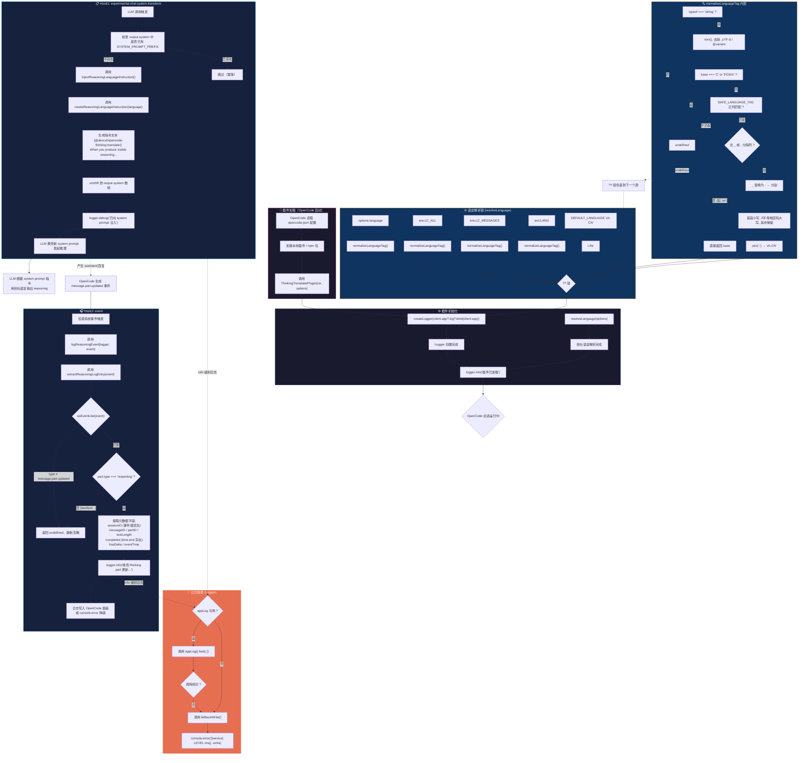

# @devcxl/opencode-thinking-translater

[](https://www.npmjs.com/package/@devcxl/opencode-thinking-translater)

> **Beta** — 核心机制已可用，API 和 hook 接口可能在未来版本中调整。

`@devcxl/opencode-thinking-translater` 是一个 OpenCode Server Plugin，用于让模型用用户本地语言输出 thinking/reasoning 内容。

## 功能

- 通过 `experimental.chat.system.transform` 注入目标语言思考指令。
- 通过 `event` hook 监听 `message.part.updated` 中的 `reasoning` part。
- 使用 `client.app.log()` 记录 session、message、part、文本长度和完成状态。
- 不记录原始 thinking 文本，不修改 `ReasoningPart.text`，避免污染会话上下文。

## 当前不做

- 不调用外部翻译 API。
- 不在 OpenCode 原生 UI 中原地替换 reasoning 文本。
- 不使用 `experimental.chat.messages.transform` 改写历史消息。

## 安装

在 `opencode.json` 的 `plugin` 数组中添加：

```json
{
  "$schema": "https://opencode.ai/config.json",
  "plugin": [
    ["@devcxl/opencode-thinking-translater", { "language": "zh-CN" }]
  ]
}
```

`language` 可省略。省略时插件按顺序读取 `LC_ALL`、`LC_MESSAGES`、`LANG`，无法推断时回退到 `zh-CN`。

OpenCode 会自动下载并加载插件，无需手动 `npm install`。

## 本地开发

```bash
git clone <repo>
npm install
npm run typecheck
npm test
npm run build
```

构建后在 `opencode.json` 中注册本地路径：

```json
{
  "$schema": "https://opencode.ai/config.json",
  "plugin": [
    ["./dist/index.js", { "language": "zh-CN" }]
  ]
}
```

修改插件配置或构建产物后，需要重启 OpenCode 才会生效。

## 完整流程



### 流程阶段说明

| 阶段 | 描述 |
|------|------|
| 插件加载 | OpenCode 从 `opencode.json` 读取插件配置，调用 `ThinkingTranslaterPlugin` 启动函数 |
| 初始化 | 创建 Logger（优先 `app.log`，失败降级 `console.error`），按优先级链解析目标语言 |
| Hook1: system.transform | 每次 LLM 调用前触发，幂等地向 `system` 数组追加推理语言指令（仅首次注入） |
| Hook2: event | 每个系统事件触发，过滤出 `message.part.updated` + `type: "reasoning"` 的事件并记录元数据 |
| 语言解析链 | 五级降级：选项 → `LC_ALL` → `LC_MESSAGES` → `LANG` → 默认 `zh-CN` |
| 标签规范化 | `zh_CN.UTF-8@variant` → 去除编码/变体后缀 → 安全正则校验 → 大小写规范化 → `zh-CN` |
| 日志路径 | 有 `appLog` 时走 OpenCode 结构化日志，失败或无 `appLog` 时降级到 `console.error` |

## 验证重点

- 插件能正常加载，启动日志出现 `plugin loaded with reasoning language ...`。
- 使用支持 reasoning 的模型时，`message.part.updated` 中的 `reasoning` part 会产生日志。
- 多轮对话后，原始 `ReasoningPart.text` 没有被插件翻译或改写。

## 后续方向

- 增加 TUI 插件，在 `sidebar_content` 中展示 reasoning 译文缓存。
- 增加翻译器抽象，支持本地命令、OpenAI-compatible API 或复用 opencode small model。
- 向上游申请 render-time part hook，只影响 UI 展示，不落库、不进入模型上下文。
